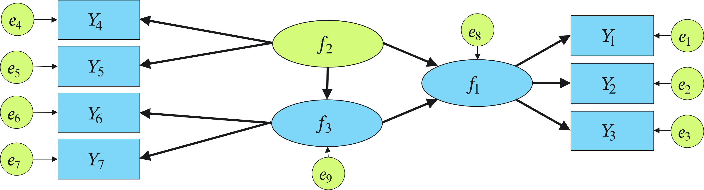
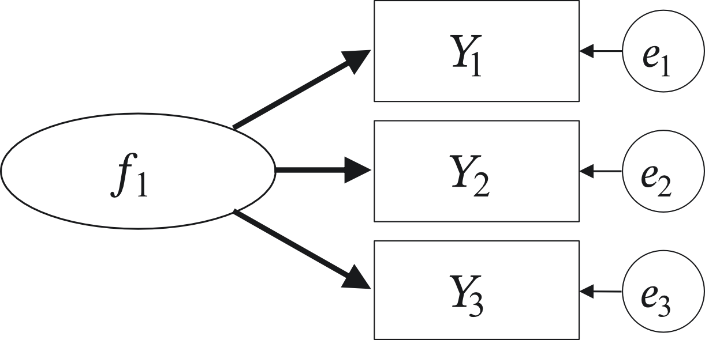
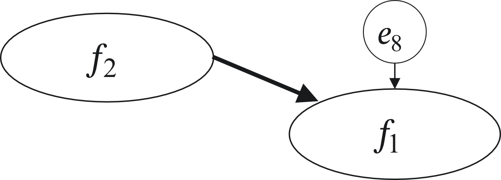

# 臨床心理学のための共分散構造分析 (SEM)ワークショップ

## イントロダクション：なぜ臨床心理学で「SEM」を使うのか？

臨床心理学の研究では，「ストレス」「抑うつ」「自尊感情」「レジリエンス」といった，「目に見えない心の内面 (構成概念)」を扱います。これらを測定するために私たちは複数の質問項目 (質問紙)を用意しますが，どれほど優れた質問紙であっても，回答のブレや体調による影響，言葉の受け止め方の違いといった「測定誤差 (エラー)」を完全に排除することはできません。

従来の「重回帰分析」では，質問項目の合計値や平均値をそのまま分析に投入していました。しかしこれでは，「測定誤差」も一緒に分析に混ぜてしまうことになります。

共分散構造分析 (Structural Equation Modeling: SEM)の最大の強みは，以下の2点にあります。

1. 「測定誤差」を数理的に切り離した上で，本当に見たい「心の内面 (潜在変数)」同士の純粋な因果関係を検証できる。
2. 複数の因果関係 (例：原因 $\rightarrow$ 媒介変数 $\rightarrow$ 結果)を，1つのモデルとして同時に検証できる。

本資料では，難しい数式をほとんど使わずに，まずは臨床心理学の身近な例で「モデルの組み立て方」を直感的に学び，後半のハンズオンでは世界標準のオープンデータ (PoliticalDemocracy)を使って実際に jamovi で分析を回すステップを解説します。

## 第1部：心理臨床の例で学ぶ基本概念と「手書き」モデリング

まずは，SEMの全体像をビジュアルで理解し，分析の設計図となる「パス図」を自分の手で描けるようになりましょう。

### 1. SEM の基本

共分散構造分析 (SEM) は，変数間の**共分散**（相関）をもとに，変数間の関係 (**構造**) を分析するモデルで，回帰分析や因子分析，パス解析などを統合する枠組みです。
共分散情報を元に，変数間の構造を統計的にモデル化することから，構造方程式モデリングとも呼ばれます (SEM の原義としては，こちらの方が正しい)。

SEM において，まず覚えておいて欲しいのは，SEM はモデルありきの分析だということです。
つまり，分析に入る前に構造モデルを指定する必要があります。
そのため，分析前に，理論や仮説に基づいて，変数間の関係を事前に記述・構造化していくことが求められます。

その考えたモデルと，観測データがフィットするかどうかを通じて，その構造の妥当性を検証していきます。
したがって，SEM の結果を見るときには，モデルの適合度と，個々の変数間の関係を表す係数の双方が解釈の際に重要になります。

また，不可能ではないものの，データに基づいて探索的にモデルを構築していくことは通常しません。

> モデルの改善をするための修正指標というものは出すことは可能ですが，あまり探索的にやり過ぎると，事前に立てた仮説を無視して，データに沿ったモデルを事後的に作り出すことに繋がりかねません。このような行為は，問題のある研究実践 (QRPs) の一つである HARKing に相当します。

まずは，この基本原則を頭にたたき込んでおきましょう。

#### SEM の用語

まずは，SEM の基本用語を覚えておきましょう。

* **観測変数 (Observed Variable)**: 直接測定された変数
  * 因子分析では項目にあたる $\rightarrow$ サンプルモデルの $Y_1 \sim Y_7$
* **潜在変数 (Latent Variable)**: 直接測定されておらず，仮定された変数
  * 因子分析では因子にあたる $\rightarrow$ サンプルの $f_1 \sim f_3$
* **誤差変数 (residual)**: 分析している変数外の効果
  * 測定誤差: 質問項目を測定する際のノイズ $\rightarrow$ $e_1 \sim e_7$
  * 構造残差: 構造モデル (後述) において，他の変数から矢印を向けられた変数の「説明しきれなかったブレ」$\rightarrow$ $e_7, e_8$
* **外生変数 (Exogeneous Variable)**: モデルの中で，一度も他の変数の結果にならない変数
  * モデルの外から導入される変数
  * 他の変数から矢印が向かず，他の変数に対して矢印が向くだけの変数 $\rightarrow$ モデル中の緑色の変数
* **内生変数 (Endogeneous Variable)**: 少なくとも一度は他の変数の結果になる変数
  * モデルの内部で変動が説明される変数
  * 少なくとも1つ以上の変数から矢印が向く変数。この変数から他の変数に矢印が向くかどうかは関係ない。$\rightarrow$ モデル中の青色の変数

<figure style="text-align: center;">
  <figcaption>Fig.1 サンプルモデル</figcaption>
  
</figure>

#### SEM を構成する基本的なモデル

次に，SEM の基本となる2つのモデルを説明します。

**測定モデル (測定方程式)**

* 共通の原因としての潜在変数が，複数個の観測変数に影響を与えている様子を記述する方程式 (因子分析的なモデル)
* 因子分析では，質問項目 (目に見える四角)から，背後にある心理特性 (目に見えない丸)を浮き彫りにする。
* サンプルモデルでは，観測変数 $Y_1 \sim Y_3$ のデータは，共通の潜在変数 $f_1$ から生み出されているという構造を考えている

<figure style="text-align: center;">
  <figcaption>Fig.2 測定モデル</figcaption>
  
</figure>

**構造モデル (構造方程式)**

* 回帰分析的な **因果関係**1 を表現するモデル
* 矢印の両端は，観測変数でも潜在変数でもどちらでも良い。
* サンプルモデルでは，潜在変数 $f_1$ は，$f_2$ に影響されるという構造を考えている

> 1日常的な用語の因果関係とは異なるので注意

<figure style="text-align: center;">
  <figcaption>Fig.3 構造モデル</figcaption>
  
</figure>

実際には，この2つを組み合わせてモデルを作っていきます。
ただし，確認的因子分析は測定方程式のみ，観測変数のみによる(重)回帰分析は構造方程式のみのモデルとなりますので，常に2種類の方程式がモデルに含まれるとは限りません。

### 2. パス図のルール

SEMでは，分析モデルを「パス図 (Path Diagram)」と呼ばれる図で表現します。
描く際，および読む際のルールは世界共通で非常にシンプルです。

* 四角形 $\square$: 観測変数 (Observed Variable)\
実際にデータシートに数字として入っているもの。質問紙の個別項目や，合計得点 (スコア)など。
* 楕円 (丸) $\bigcirc$: 潜在変数 (Latent Variable)\
目に見えない心の内面。観測変数 (四角)を束ねることで，統計的に推定されたもの。
* 片矢印 $\rightarrow$: 因果関係 (Path)\
矢印の根元が「原因 (独立変数)」，先が「結果 (従属変数)」。
* 両矢印 $\leftrightarrow$: 相関 (Correlation)，または共分散 (Covariance)\
2つの変数の間に，因果関係は特定しないが，お互いに関連があることを示す。
* 小さな矢印と記号 $e$: 誤差・残差 (Error)
  * 測定誤差: 質問項目 (四角)を測定する際のノイズ。
  * 構造残差: 構造モデルにおいて，他の変数から矢印を向けられた変数の「説明しきれなかったブレ」。

### 3. 【アクティブ・ワーク】紙とペンでモデルを描いてみよう

臨床心理学の研究でよく使われる「媒介モデル (間接効果モデル)」を例に，実際に手を動かして図を描いてみましょう。

ここでは，「合計スコア (観測変数)」として扱う変数と，「項目を束ねて潜在変数」として扱う変数の違いを意識しながらモデルを組み立てます。

#### 【お題】

「ストレス対処行動 (コーピング)の合計スコア」が，「自尊感情 (潜在変数)」を高め，その結果として「抑うつ症状の合計スコア」が軽減される。

* 潜在変数 (丸 $\bigcirc$):自尊感情 (変数名：Esteem)
  * 目に見えない心の内面として，Rosenbergの自尊感情尺度 (10項目)から統計的に推定します。
* 観測変数 (四角 $\square$):
  * `Coping`：コーピング質問紙の合計点 (データとして数字が1つだけ存在)
  * `Depress`：抑うつ質問紙の合計点 (データとして数字が1つだけ存在)
  * `est_1 〜 est_10`：Rosenberg自尊感情尺度の個別質問10項目 (計10個の変数)

#### 【作図の手順】

1. メインの変数を配置する
   1. 紙の左側にコーピングを表す 四角形 $\square$ (`Coping`) を描きます。
   2. 紙の右側に抑うつを表す 四角形 $\square$ (`Depress`) を描きます。
   3. 紙の真ん中に自尊感情を表す 楕円 (丸) $\bigcirc$ (`Esteem`) を描きます。
2. 自尊感情の「測定モデル (因子分析部分)」を描く
   1. 真ん中の○ (`Esteem`) の下に，10個の小さな 四角形 $\square$ (`est_1` 〜 `est_10`) を一列に並べて描きます。
   2. `Esteem` から，その下にある10個の四角それぞれに向かって，上から下へ **片矢印 $\rightarrow$ を10本** 引きます。
   3. 10個の四角のそれぞれに対して，下から乗るような **測定誤差 ($e_1$ 〜 $e_{10}$)の小さな矢印** を引きます。
   4. これで，自尊感情という「目に見えない構成概念 (丸)」が，10個の質問 (四角)に影響を与えている測定モデルが完成しました。
3. 「構造モデル (回帰分析部分)」を描く (仮説の矢印)
   1. 左の `Coping` (四角) $\rightarrow$ 真ん中の `Esteem` (丸) へ片矢印を引きます。
   2. 真ん中の `Esteem` (丸) $\rightarrow$ 右の `Depress` (四角) へ片矢印を引きます。
   3. 左の `Coping` (四角) $\rightarrow$ 右の `Depress` (四角) へ，直接の影響を表す片矢印を引きます。
4. 構造残差を描く
   1. 他の変数から矢印を「向けられている (影響を受けている)」変数には，説明しきれないブレが存在します。
   2. 真ん中の `Esteem` (丸)に対して，外側から小さな 構造残差 ($e_{11}$) を矢印で差し込みます。
   3. 右の `Depress` (四角)に対して，外側から小さな 構造残差 ($e_{12}$) を矢印で差し込みます。

#### 【方程式 (数式)の意識化】

今描いた図は，統計的にはいくつかの「方程式」を同時に表しています。手書きの図を見ながら，以下の2種類の方程式を書き出してみましょう。

**① 測定方程式 (Measurement Equation)**

自尊感情 (丸)が個々の質問 (四角)にどう表れているかを示す数式です。
例として，1項目目 (est_1)と10項目目 (est_10)の方程式を書いてみましょう。

$est_1 = \lambda_1 \times \text{Esteem} + e_1$

$est_{10} = \lambda_{10} \times \text{Esteem} + e_{10}$ 

$\lambda$ (ラムダ)は「因子負荷量」と呼ばれる係数です。

**② 構造方程式 (Structural Equation)**

変数同士の因果関係を示す数式です。矢印がどこから刺さっているかに注目して，影響を受けている変数 (Esteem と Depress)の方程式を書いてみましょう。

$\text{Esteem} = \beta_1 \times \text{Coping} + e_{11}$

$\text{Depress} = \beta_2 \times \text{Coping} + \beta_3 \times \text{Esteem} + e_{12}$

※ $\beta$ (ベータ)は「回帰係数 (影響の強さ)」， $e$ は「残差」です。

### **【第1部のまとめ】**

このように，「四角 (データそのもの)」と「丸 (目に見えない概念)」を区別して整理することで，単なる合計点の回帰分析 (四角 $\rightarrow$ 四角)と，測定誤差を排除したSEM (丸を挟む分析)の違いが，ビジュアルと方程式の両面から劇的にスッキリ理解できるようになります。これが理解できれば，次のjamoviでの変数指定や，lavaanのコード記述は「図をそのまま文字に書き写すだけ」の簡単な作業になります。
