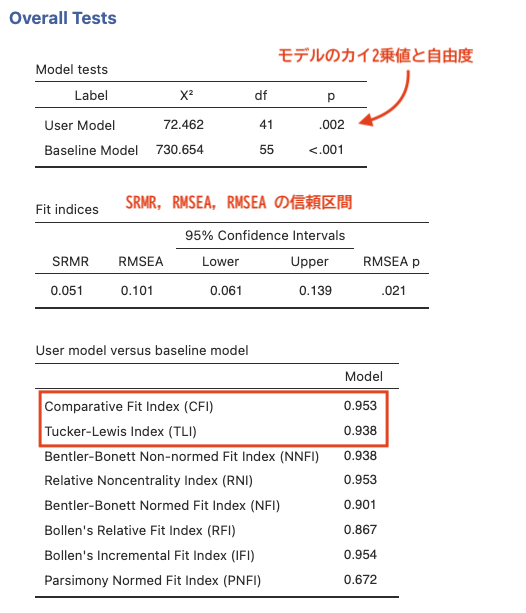
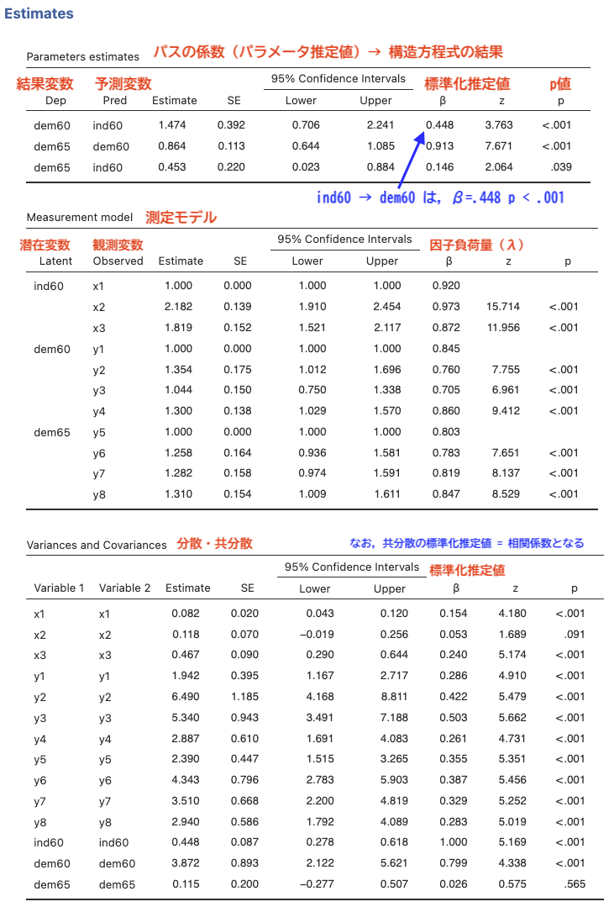

# 臨床心理学のための共分散構造分析 (SEM)ワークショップ

## 第3部：出力の読み解き方とトラブル対処法

分析が走ったら，結果のどこをどう読めば良いのでしょうか。初心者が陥りがちなエラーの解決法とともに解説します。

### 1. これだけ見ればOK！適合度指標 (Model Fit)の足切りライン

モデル全体が，集めたデータとどれくらい「調和しているか (矛盾がないか)」を表す指標です。論文に書くために，以下の数値を `Overall Tests` セクションでチェックします。

* $\chi^2$ 値 (カイ二乗値)と自由度 ($df$)
  * 統計的には「$p > .05$  (有意でない)」が理想ですが，サンプルサイズが大きいとすぐに有意 ($p < .05$)になってしまうため，あまり気にしなくて構いません。論文には数値だけ記載します。
* CFI (Comparative Fit Index) / TLI (Tucker-Lewis Index)
  * **目標**： $.95$ 以上  (最低でも $.90$ 以上なら実用レベル)
  * 1に近づくほど，モデルがデータに良く適合していることを示します。
* RMSEA (Root Mean Square Error of Approximation)
  * **目標**： $.06$ 以下  ($.08$ 以下なら許容範囲, $.10$ を越えたらダメ)
  * モデルの「ズレ (誤差)」を表すため，数値が小さいほど優秀です。
* SRMR (Standardized Root Mean Square Residual)
  * **目標**： $.08$ 以下こちらも残差 (ズレ)なので，小さいほど優秀です。

<figure style="text-align: center;">
  <figcaption>Fig.7 適合度指標</figcaption>
  
</figure>

### 2. 係数の読み解き方 (Path Coefficients)

各矢印 (パス)の強さを確認します。

* 「標準化係数 (Standardized Estimate / $\beta$)」を見る：
  * 変数の単位の影響を排除した係数です。常に $-1.0$ から $+1.0$ の間 の値をとります。
  * dem60 $\rightarrow$ dem65 の $\beta$，および ind60 $\rightarrow$ dem65 の $\beta$ を確認し，どちらの方が「1965年時点の民主化」に強く影響しているかを比較します。
* $p$ 値 (Significance)を見る：
  * 各パスについて，p値を確認し，統計的に有意な影響があるか ($p < .05$) を判断します。

<figure style="text-align: center;">
  <figcaption>Fig.8 パラメータ推定値</figcaption>
  
</figure>

### 3. ありがちなエラー！動かないときのトラブル対処法

臨床心理データや質問紙のデータ特性により，エラーで止まることがよくあります。慌てずに対処しましょう。

#### ① 「モデルが収束しません (Model did not converge)」

* **原因**：計算のループが無限に続いてしまい，答えが出せなかった状態です。
* **対処**：逆転項目の処理忘れがないか？ (臨床心理スケールで最頻出)：例えば，抑うつ尺度の中に「毎日が楽しい」という逆質問が混ざっており，得点を反転し忘れていると，測定モデルが混乱して収束しません。サンプルサイズ不足：観測変数に対してデータ数が少なすぎないか (目安として，パス図の「矢印の数」の10倍〜20倍以上の人数が必要です。最低でも $N=100$ 〜 $150$ 以上が望ましい)。

#### ② 不適切な解「ヘイウッド・ケース (Heywood Case)」

計算は終わったものの，あり得ない数値が出力されている状態です。

* **現象**：
  * 標準化されていない「エラーの分散 (Variance)」が マイナス になっている。
  * 標準化パス係数 ($\beta$)や相関係数が $1.0$ を超えている。
* **原因**：
  * 特定の質問項目同士が似すぎていて (多重共線性)，計算が破綻している。
  * 一部の項目の回答が全員「1 (全く当てはまらない)」に偏っているなど，分散が極端に小さい。
* **対処**：
  * 偏りの激しい不適切な観測変数をモデルから除外する。
  * 潜在変数 (丸)を使うのを諦め，各尺度の「平均値 (または合計値)」を算出し，四角 (観測変数)同士のパス解析 (単純な重回帰の連立)に変更する。これは「妥当な妥協ルート」として臨床研究で非常によく使われます。

## 第4部：指導教員も安心！妥当性チェック ＆ 論文執筆ガイド

最後に，指導教員が学生の分析結果をレビューする際のポイントと，論文の執筆フォーマットをまとめます。

### 1. 指導教員用：「学生の分析，本当に大丈夫？」点検チェックリスト

学生から「SEMの分析が終わりました！こんなキレイなパス図になりました！」と報告を受けた際，教員がチェックすべき4つの関門です。

* 【チェック1：警告の有無】
  * jamoviの出力画面の下部に，警告メッセージ (Warning)や注記 (Note)が出ていないか？
* 【チェック2：ヘイウッド・ケースの確認】
  * 標準化された係数の表を見て，値が $1.0$ を超えているパス (または相関)はないか？
  * 「Variances」の表にマイナスの値はないか？
* 【チェック3：適合度の過度な追求 (こじつけ)の有無】
  * 学生が「適合度が悪かったので，ソフトの提案 (Modification Indices: 修正指標)に従ってたくさん相関 (~~)の線を引きました」と言っていないか？
  * **指導のポイント**：臨床的に意味が説明できない (例：『抑うつ』の残差と『誤信念課題』の残差を相関させるなど)安易な修正は，データへの「こじつけ (過適合)」であり，学術的に認められません。パスの追加・削除は，必ず「理論的・先行研究的な根拠」に基づいて行うよう指導してください。
* 【チェック4：媒介効果の信頼性 (ブートストラップ法)】
  * 媒介分析 (間接効果)を行っている場合，単純なかけ算 ($\beta_a \times \beta_b$)だけでなく，「ブートストラップ法 (Bootstrap)」による信頼区間 (95%CI)を算出し，それが「0を跨いでいないか」を確認しているか？ (SEMLjの設定パネルで「Standard errors」を「Bootstrap」にするだけで算出可能です)。

### 2. 論文 (結果セクション)への記載テンプレート

実際に論文を書く際は，以下の要素を漏れなく記述します (臨床心理学の媒介モデルを想定した一般的なテンプレートです)。

* 【方法 (Method)セクションでの記述例】

> 本研究のモデル検証には，統計解析ソフト jamovi (Version 2.x)および追加モジュール SEMLj を用いて，共分散構造分析 (SEM)を行った。パラメータの推定には最尤法 (Maximum Likelihood: ML)を用い，モデルの適合度の評価には，$\chi^2$値，自由度 ($df$)，CFI，TLI，RMSEA，およびSRMRを用いた。なお，間接効果の有意性検定には，ブートストラップ法 (リサンプリング回数 2000回)による95%バイアス補正信頼区間を採用した。

* 【結果 (Result)セクションでの記述例】

> 構築した仮説モデルを分析した結果，モデルの適合度は $\chi^2(24) = 45.12, p = .006$，$\text{CFI} = .972$，$\text{TLI} = .958$，$\text{RMSEA} = .051$, $95\% \text{ CI}[ .028, .074]$，$\text{SRMR} = .042$ となり，すべての指標において良好な適合基準を満たした (Figure 1)。各パス係数を検討した結果，ストレス対処行動から自尊感情へのパス ($\beta = .45, p < .001$)，自尊感情から抑うつへのパス ($\beta = -.38, p < .001$)はいずれも有意であった。ブートストラップ法による間接効果の検証の結果，ストレス対処行動が自尊感情を媒介して抑うつに与える間接効果は有意であった ($\beta = -.17$，95%信頼区間 $[-0.27, -0.09]$)。

## ワークショップ後の振り返り用：自学のためのリソース

1. **ワークショップのフルバージョンの PDF** ([https://yoshi-mjm.github.io/labs/SEM-WS-full.pdf](https://yoshi-mjm.github.io/labs/SEM-WS-full.pdf))
2. **SEMLj 公式ドキュメント** ([https://semlj.github.io/](https://semlj.github.io/)): SEMLjの使い方のチュートリアルや，データの読み込み方が豊富に掲載されています。
3. **lavaan公式Webサイト** ([https://lavaan.ugent.be/](https://lavaan.ugent.be/)): より高度なモデル (マルチグループ分析など)にステップアップする際のシンタックス例が網羅されています。
4. **トラブルが起きたら**: まずは「観測変数 (平均値)のパス解析」に一度戻り，データの相関関係が想定通りかを単純な相関行列で確認することをお勧めします。